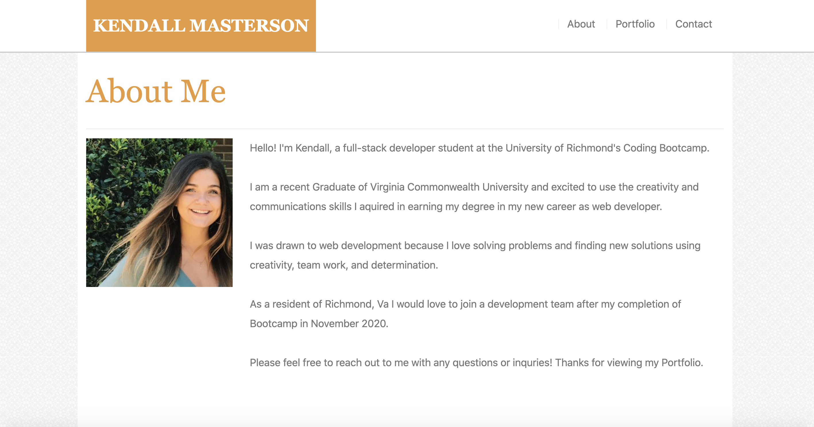
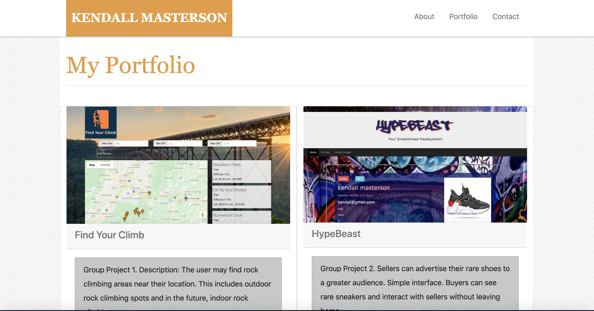
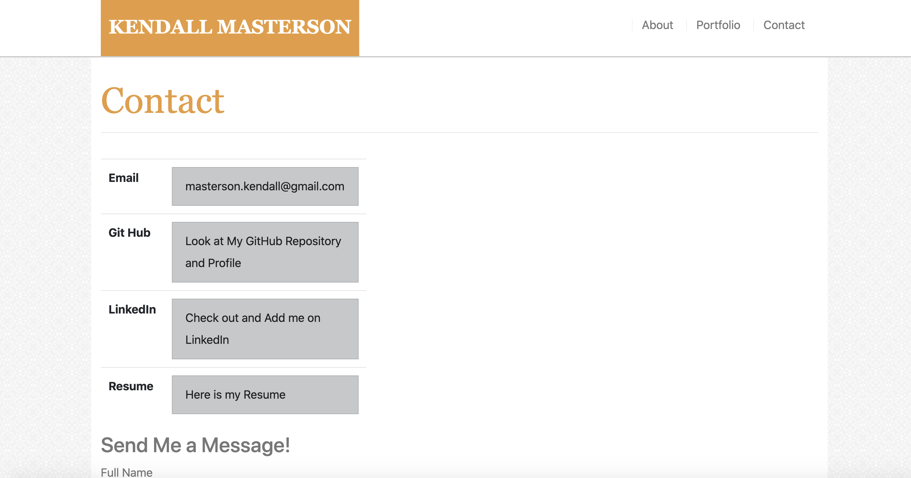

# homework-portfolio-update

<h1>Kendall Masterson Porfolio</h1>

Live version: https://mastersonkl.github.io/homework-portfolio-update/

<h2> Author </h2>
Kendall Masterson -https://github.com/mastersonkl

<h2> About </h2>
Portfolio page to introduce myself, show my work, and to give different ways to get in touch with me. 

<h2> About Page </h2>

- Introduce myself, my background, and education. 

<h2>Porfolio Page</h2>

<strong>Find Your Climb</strong> - Picture of the website. Bottom has decription of the project. If you click on the description it will take you to the deployed project on Git Hub.

<strong>HypeBeast</strong> - Picture of the website. Bottom has decription of the project. If you click on the description it will take you to the deployed project on Heroku.

<h2>Contact Page</h2>

-Lists ways to get in touch with me
<strong>Email</strong> -click on my email address and will open to your email with my email populating. 
<strong>Git Hub</strong> -click Look at my Git Hub and it will take you to my profile in a new tab. 
<strong>LinkedIn</strong> -click on Check out my LinkedIn and it will open my profile in a new tab.
<strong>Resume</strong> -click on Here is my resume and a new tab will open of a PDF of my latest resume. 

-Scroll down to Send Me a Message! 
-fill out all the fields and send me a message by pressing submit.

